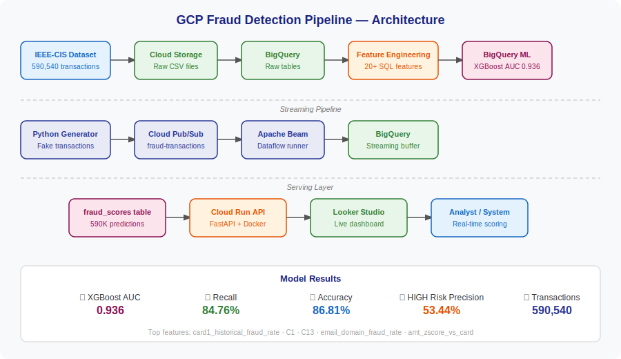

# 🔍 GCP Fraud Detection Pipeline

An end-to-end real-time fraud detection system built entirely on Google Cloud Platform, combining streaming data pipelines with BigQuery ML and a live inference API.

## 🏆 Model Performance

| Metric | Value |
|---|---|
| **ROC-AUC** | **0.936** |
| **Recall** | **84.76%** |
| **Accuracy** | **86.81%** |
| HIGH Risk Precision | 53.44% |
| Transactions Scored | 590,540 |

> XGBoost model catches **84.76% of all real fraud cases** with a 93.6% AUC — production-grade performance.

## 🏗️ Architecture



## 🛠️ Tech Stack

| Layer | Technology |
|---|---|
| Ingestion | Google Cloud Storage, BigQuery |
| Streaming | Cloud Pub/Sub, Apache Beam, Dataflow |
| Feature Store | BigQuery SQL (20+ engineered features) |
| ML Training | BigQuery ML — Logistic Regression + XGBoost |
| Serving | Cloud Run, FastAPI, Docker |
| Visualisation | Looker Studio |
| Orchestration | Cloud Shell, gcloud CLI |

## 📊 Live Dashboard

🔗 [Fraud Detection Dashboard](https://datastudio.google.com/reporting/302c858f-b58c-493f-8212-9e7f98760fe3)


## 📁 Project Structure
```
fraud-detection-gcp/
├── api/                          # Cloud Run inference API
│       ├── main.py                   # FastAPI app with BQML predict
│       ├── Dockerfile                # Container definition
│       └── requirements.txt
├── pipeline/                     # Apache Beam streaming pipeline
│   └── fraud_pipeline.py         # Pub/Sub → BigQuery
├── simulator/                    # Transaction data generator
│   ├── transaction_generator.py  # Publishes to Pub/Sub
│   └── verify_messages.py        # Message consumer/verifier
├── sql/                          # All BigQuery SQL
│   ├── 01_create_base_view.sql
│   ├── 02_card_aggregates.sql
│   ├── 03_email_domain_risk.sql
│   ├── 04_ml_features.sql
│   └── day8/                     # Model training SQL
│       ├── 01_train_test_split.sql
│       ├── 02_model_logistic_regression.sql
│       ├── 03_model_xgboost.sql
│       ├── 04_evaluate_models.sql
│       └── 05_feature_importance.sql
├── schemas/                      # BigQuery table schemas
├── diagrams/                     # Architecture diagram
└── screenshots/                  # Dashboard screenshots

```
## 🔑 Key Findings

- **card1_historical_fraud_rate** is the #1 fraud predictor (importance: 625)
- Custom engineered features **email_domain_fraud_rate** (#7) and **amt_zscore_vs_card** (#12) ranked in top 12 of 30+ features
- **Product C** (cashback) has the highest fraud rate at **11.69%** vs 2.04% for Product W
- **Late-night transactions** (midnight–6AM) have **13% higher fraud rate** than daytime
- HIGH risk bucket contains **53.44% actual fraud** — model is well-calibrated

## 🚀 API Usage

**Base URL:** `https://fraud-detection-api-z5f5d5jmxa-el.a.run.app`

```bash
# Health check
curl https://fraud-detection-api-z5f5d5jmxa-el.a.run.app/health

# Score a transaction
curl -X POST https://fraud-detection-api-z5f5d5jmxa-el.a.run.app/predict \
  -H "Content-Type: application/json" \
  -d '{
    "TransactionAmt": 299.99,
    "ProductCD": "C",
    "card4": "visa",
    "P_emaildomain": "gmail.com",
    "DeviceType": "desktop",
    "card1_historical_fraud_rate": 0.15
  }'
```

**Response:**
```json
{
  "fraud_probability": 0.551674,
  "predicted_fraud": 1,
  "risk_level": "MEDIUM",
  "transaction_amount": 299.99,
  "model": "xgboost",
  "scored_at": "2026-04-29T06:00:04Z"
}
```

## 📈 Dataset

**IEEE-CIS Fraud Detection** (Kaggle)
- 590,540 transactions
- 3.5% fraud rate (class imbalanced — handled with auto_class_weights)
- 394 features → reduced to 30 engineered features

## ⚙️ How to Run

### Prerequisites
- GCP account with billing enabled
- Python 3.11+
- Docker

### Setup
```bash
# Clone repo
git clone https://github.com/KrishnaVamshi6570/fraud-detection-gcp.git
cd fraud-detection-gcp

# Set GCP project
gcloud config set project YOUR_PROJECT_ID

# Enable APIs
gcloud services enable bigquery.googleapis.com pubsub.googleapis.com \
  run.googleapis.com dataflow.googleapis.com storage.googleapis.com

# Run transaction simulator
python3 simulator/transaction_generator.py \
  --project-id=YOUR_PROJECT_ID \
  --num-messages=100 \
  --fraud-rate=0.10

# Run Beam pipeline
python3 pipeline/fraud_pipeline.py \
  --project-id=YOUR_PROJECT_ID \
  --subscription=projects/YOUR_PROJECT_ID/subscriptions/fraud-transactions-sub \
  --bq-table=YOUR_PROJECT_ID:fraud_detection.streaming_transactions \
  --runner=DirectRunner
```

## 📝 Progress

- [x] Day 1 — GCP setup, APIs, service account, GCS bucket
- [x] Day 2 — BigQuery schema design + raw data ingestion (590K rows)
- [x] Day 3 — Feature engineering (20+ SQL features)
- [x] Day 4 — Pub/Sub transaction simulator
- [x] Day 5 — Apache Beam streaming pipeline → BigQuery
- [x] Day 8 — BigQuery ML model training (XGBoost AUC 0.936)
- [x] Day 9 — Batch predictions + fraud scores table
- [x] Day 10 — Cloud Run inference API (FastAPI + Docker)
- [x] Day 11 — Looker Studio fraud detection dashboard
- [x] Day 12 — Final polish + architecture diagram

## 👤 Author

**KrishnaVamshi6570**
[GitHub](https://github.com/KrishnaVamshi6570)


