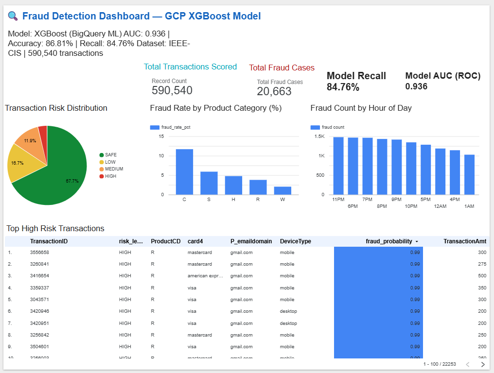

# GCP Fraud Detection Pipeline

An end-to-end fraud detection pipeline built on Google Cloud Platform.

## Architecture
- **Ingestion:** Pub/Sub + Apache Beam / Dataflow
- **Storage:** Google Cloud Storage + BigQuery
- **ML:** BigQuery ML (Logistic Regression + XGBoost)
- **Serving:** Cloud Run (FastAPI)
- **Visualisation:** Looker Studio

## Dataset
IEEE-CIS Fraud Detection dataset — 590,540 transactions, 3.5% fraud rate.

## Progress
- [x] Day 1 — GCP setup, APIs, service account, GCS bucket
- [x] Day 2 — BigQuery schema design + raw data ingestion
- [x] Day 3 — Feature engineering
- [x] Day 4 — Pub/Sub streaming simulator
- [x] Day 5 — Beam pipeline
- [x] Day 8 — BigQuery ML model training
- [x] Day 9 — Batch predictions
- [x] Day 10 — Cloud Run inference API
- [ ] Day 11 — Looker Studio dashboard
- [ ] Day 12 — Final polish + architecture diagram

## Live Dashboard
🔗 [Fraud Detection Dashboard](https://datastudio.google.com/reporting/302c858f-b58c-493f-8212-9e7f98760fe3)

## Dashboard Preview

